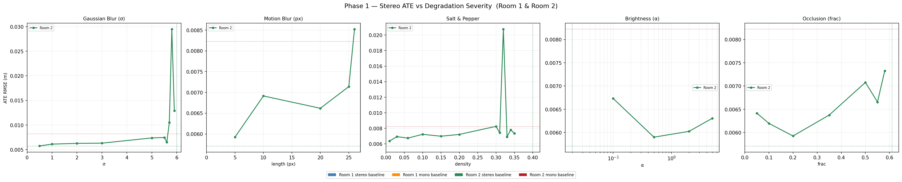
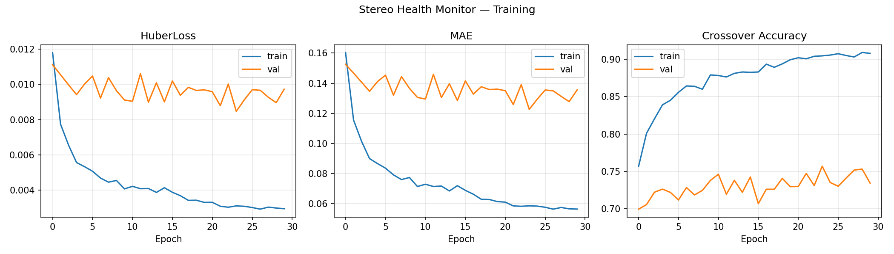
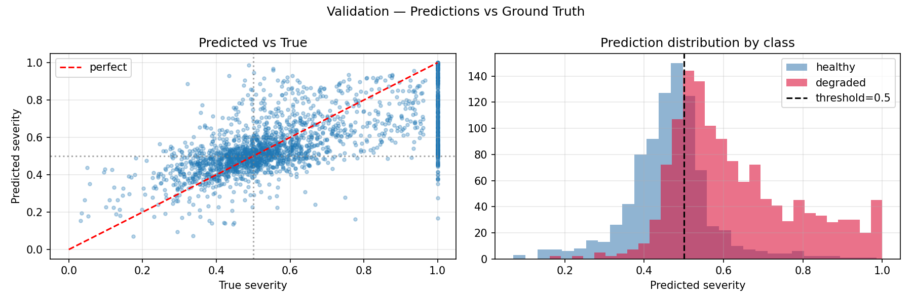

# Stereo Camera Health Monitor for ORB-SLAM3

## Problem

A stereo camera silently degrading is worse than one that fails outright. When one lens gets blurry, occluded, or underexposed, ORB-SLAM3 keeps producing output with no signal that anything's wrong — trajectory error accumulates undetected until tracking collapses entirely. We hypothesized that there's a well-defined crossover point — a degradation level at which stereo SLAM performs no better than a clean monocular pipeline — and that this point is detectable from image appearance alone, before tracking loss happens. If true, a monitor that predicts proximity to this crossover could trigger a proactive mode switch, turning a silent catastrophic failure into a controlled graceful degradation.

## Architecture / Methodology

The full pipeline takes TUM-VI stereo-inertial input, applies one of five degradation types to the right camera stream at increasing severity levels, and runs ORB-SLAM3 in stereo-inertial mode. Trajectory output is evaluated against motion-capture ground truth (via the `evo` toolkit), while a parallel clean monocular run establishes a fixed switching threshold. A health monitor then learns to detect degradation using only internal stereo signals — no ground truth, no knowledge of degradation type.

**Degradation types tested (right camera only, left stays clean):** Gaussian blur, motion blur, salt & pepper noise, brightness reduction, occlusion — each swept across multiple severity levels, all fully reproducible from saved offline image sets.

**Severity metric** — defined so comparisons are consistent across degradation types, with no manual labeling required:

```
severity = ATE_stereo / (ATE_stereo + ATE_mono)
```

- `0.0` — stereo performing at its healthy baseline
- `0.5` — crossover point: stereo and mono perform equally → switch
- `1.0` — stereo has failed entirely

**Health monitor design** — a single learned model, trained end-to-end directly on raw stereo image pairs (no hand-engineered signals):
- **Per-frame encoding:** each left/right pair goes through a shared ResNet18 backbone (ImageNet-pretrained, only the last block fine-tuned). Left, right, and a left-minus-right difference embedding are concatenated and projected down — the difference term explicitly captures left-right asymmetry, the signal a degraded single lens actually produces.
- **Temporal aggregation:** a 20-frame window of these embeddings is fed through a GRU, so the model sees degradation building up over time, not just a single frame.
- **Output:** the GRU's final hidden state goes through a small classifier head (Linear → ReLU → Dropout → Linear → Sigmoid) to produce one severity score in [0, 1], trained with Huber loss against the ATE-derived severity label.

Trained on TUM-VI Room1 with a class-balanced sampler (healthy/mild/degraded/severe bins) to correct for most windows being near either extreme, and evaluated with **crossover accuracy** — whether the predicted severity lands on the same side of the 0.5 threshold as the true label.

## My Contribution

This was a 5-person team project for EECE 5554 (Robotics Sensing and Navigation) at Northeastern. I originated the research question and the overall project design, defined the severity metric used to make degradation types comparable, and chose the ResNet18+GRU architecture for the health monitor. I built the experimental platform — the pipeline structure, severity labeling, and health monitor scaffolding — that the rest of the team ran degradation sweeps and training experiments on, and synthesized their results back into project direction.

## Setup & Running

**Prerequisites:** Linux, Python 3.10+, CUDA GPU (recommended), ORB-SLAM3 built from source.

```bash
# 1. Build ORB-SLAM3
git clone https://github.com/UZ-SLAMLab/ORB_SLAM3.git
cd ORB_SLAM3 && chmod +x build.sh && ./build.sh && cd ..

# 2. Install Python dependencies
pip install torch torchvision opencv-python-headless numpy pandas matplotlib scikit-learn evo pyyaml

# 3. Download TUM-VI sequences (room1, room2) and copy timestamp/IMU files from ORB-SLAM3
#    — see full instructions in this repo's original README for exact paths
```

**Run the pipeline:**

```bash
# Phase 1 — clean baselines + degradation sweeps
python run_pipeline.py --config experiments/clean.yaml
python run_pipeline.py --config experiments/blur_sweep_B.yaml   # + 4 more degradation sweeps
python analysis/phase1_analysis.py

# Phase 2 — build dataset, train the health monitor
python health_monitor/build_dataset_index.py --baseline clean --experiments blur_sweep_B motion_blur_sweep snp_sweep brightness_sweep occlusion_sweep --skip-failed
python health_monitor/train.py --quick   # quick sanity check (~1 min)
python health_monitor/train.py           # full training (~2-4 hrs on GPU)

# Sanity check against known conditions
python analysis/model_sanity_check.py
```

## Results

**Failure signature per degradation type** — not all degradations are equally dangerous or equally learnable:

| Type | Fails at | ATE vs. clean | Curve shape |
|---|---|---|---|
| Gaussian blur | σ = 6.1 | +50% | Gradual — learnable warning zone |
| Motion blur | 28px kernel | +150% | Steep — strong but short warning |
| Salt & pepper | 33–35% pixels | +110% | Flat, then cliff — no gradient |
| Brightness drop | α = 0.03 | +44% | Asymmetric — underexposure only |
| Occlusion | 61% blocked | +26% | Flat, then cliff — no gradient |

**Key findings:**
- The clean monocular baseline (ATE 0.0102m) is a physically meaningful crossover threshold, not an arbitrary cutoff — as the right camera degrades, stereo loses its depth advantage and converges toward mono-equivalent performance right before tracking fails outright.
- Salt & pepper noise and occlusion produce **no usable warning signal** — ORB-SLAM3's built-in RANSAC outlier rejection absorbs random/blocked pixels until it can't, then fails in a single step. These need a rule-based fallback, not a learned model.
- Underexposure is far more dangerous than overexposure — ORB feature detection depends on intensity gradients, which collapse in very dark images but survive even heavy overexposure.
- Gaussian blur and motion blur are the best-suited degradations for learned health monitoring — both produce a gradual, monotonic severity curve the model can actually learn from.

**Health monitor accuracy:** ~75% crossover accuracy on the full validation set; 80% on a smaller 65-window sanity check across 13 known conditions.

**Phase 1 — ATE vs. degradation severity, all five types:**



**Phase 2 — training curves and validation predictions:**





## Future Work

The full vision was a real-time, onboard health monitor — this project validates the core idea (crossover point exists, is learnable for gradual degradations) offline on recorded sequences. Next steps:

- **Rule-based fallback** for the non-learnable degradations (salt & pepper, occlusion) identified in this study, so the monitor covers all five failure modes, not just the two with usable gradients.
- **Live ORB-SLAM3 integration** — wire the trained model into a running SLAM instance to actually trigger the mono-inertial switch, instead of evaluating on saved trajectories.
- **Generalization beyond TUM-VI Room1** — validate on Room2 and other sequences to check the crossover threshold and model hold up outside the training distribution.

If you're working on SLAM robustness or sensor health monitoring and want to build on this, reach out — happy to collaborate.
